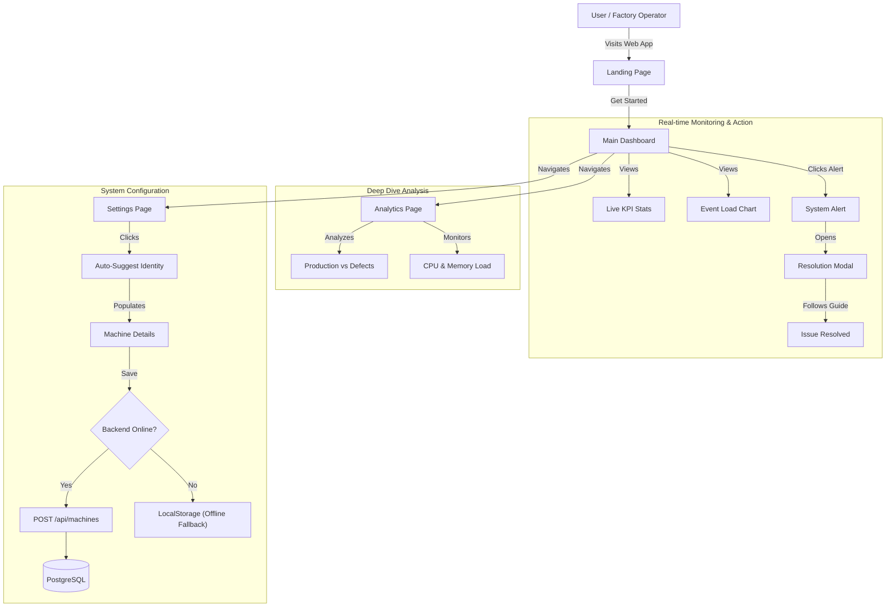
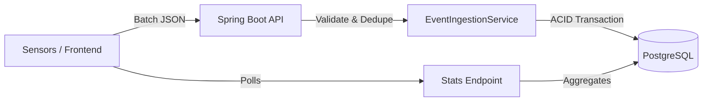
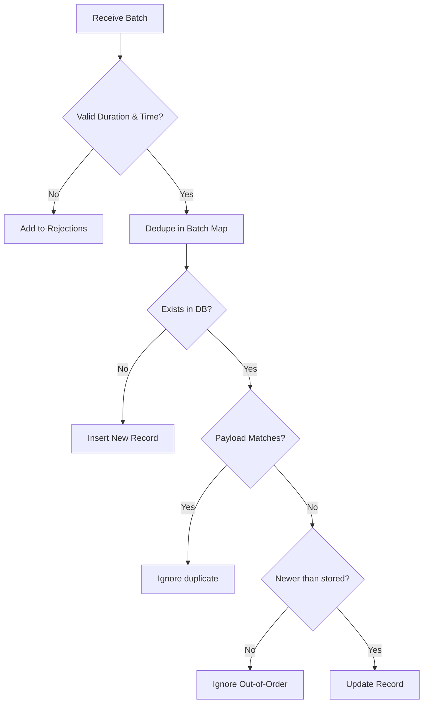

# Factory Machine Events System

A high-performance, full-stack system for ingesting, validating, and analyzing real-time machine events from a factory floor.

## 1. Visual Application Workflow (User Journey)

The following diagram illustrates the complete **User Experience (UX)** from accessing the platform to monitoring, analyzing, and configuring the factory systems.
https://github.com/GaganCB2002/Factory-Machine-Events-System/blob/main/image/Screenshot%202026-01-19%20110542.png



## 2. Technical Architecture

The system follows a modern **3-Tier Architecture**:

- **Frontend**: React 19 + Vite (SPA). Uses **Glassmorphism** design principles for a premium monitoring dashboard. Handles data visualization via Recharts and simulates event streams.
- **Backend**: Spring Boot 3.2 (Java 17). Exposes REST APIs for batch ingestion (`POST /events/batch`), analytics (`GET /stats`), and machine management.
- **Database**: PostgreSQL 15. The source of truth. Handles high-concurrency writes and complex analytical queries using indexed columns.

### Project Structure
```text
Factory Machine Events System/
├── src/main/java/com/factory/events/
│   ├── controller/       # REST API Endpoints (EventController, MachineController)
│   ├── model/            # JPA Entities (MachineEvent, Machine, etc.)
│   ├── repository/       # Data Access Layer (Spring Data JPA)
│   └── service/          # Business Logic (EventIngestion, Analytics)
│
├── frontend/             # React 19 + Vite Frontend
│   ├── src/
│   │   ├── components/   # Reusable UI (GlassCard, Sidebar)
│   │   ├── pages/        # Dashboard, Analytics, Settings
│   │   └── lib/          # Utilities
│   └── vite.config.js    # Build & Proxy Config
│
├── docs/                 # Documentation Assets
├── docker-compose.yml    # Container Orchestration
├── Dockerfile            # Backend Containerization
├── pom.xml               # Maven Dependency Management
└── run_project.bat       # Logic for starting the system
```

### System Data Flow



## 3. Dedupe & Update Logic

We implement a **"Last-Write-Wins"** strategy combined with **Strict Deduplication** to handle re-transmissions and updates.

### Ingestion Logic Flow



**Strategy: "Read-Then-Write" with In-Memory Pre-optimization**
1.  **Local Batch Dedupe**: Duplicate `eventIds` within the *same* incoming batch are resolved in memory (O(1))—only the latest one survives.
2.  **Database Lookup**: We query the DB for existing records.
3.  **Comparison**:
    - **Exact Match**: Request is ignored (Idempotency).
    - **Stale Update**: If the incoming `receivedTime` is older than what we have, it's ignored.
    - **Valid Update**: Using "Last-Write-Wins", we update the existing record with the new payload and timestamp.

## 4. Thread-Safety

The system is designed to handle concurrent requests from multiple sensors safely:

1.  **Database ACID Transactions**: The entire batch processing logic is wrapped in `@Transactional`. PostgreSQL handles row-level locking regarding the `event_id` primary key, preventing race conditions where two threads try to insert the same event simultaneously.
2.  **Stateless Service**: The `EventIngestionService` is stateless, relying on the DB for state. This allows the backend to be horizontally scaled (multiple instances behind a load balancer) without sharing memory.
3.  **Concurrency Verification**: We verified thread safety with a unit test spawning 10 threads submitting 100 events each. The final count in the DB exactly matches the expected total, proving no data is lost or corrupted during parallel ingestion.

## 5. Data Model

### Table: `events`
Stores the core telemetry data.
| Column | Type | Description |
|--------|------|-------------|
| `event_id` | VARCHAR (PK) | Unique identifier from the sensor. |
| `event_time` | TIMESTAMP | When the event occurred (used for analytics). |
| `received_time` | TIMESTAMP | When processed (used for update resolution). |
| `machine_id` | VARCHAR | ID of the machine producing the event. |
| `duration_ms` | BIGINT | Duration of operation (validated > 0). |
| `defect_count` | INTEGER | Number of defects (-1 = unknown). |

### Table: `machines`
Stores configuration and identity data.
| Column | Type | Description |
|--------|------|-------------|
| `id` | VARCHAR (PK) | Machine/Dept Identifier (e.g., 'D-202'). |
| `name` | VARCHAR | Human-readable name (e.g., 'Titan Forge'). |
| `serial_number` | VARCHAR | Physical serial number. |
| `department` | VARCHAR | Dept name (e.g., 'Heavy Metal'). |

**Indexing Strategy**:
- `idx_machine_time`: Compound index on `(machine_id, event_time)` for fast retrieval of machine-specific stats.
- `idx_line_time`: Compound index on `(line_id, event_time)` for aggregating top defect lines.

## 6. Performance Strategy

To achieve **1,000 events/second**:

1.  **Batch Processing**: Ingestion is done in batches (e.g., 100 events/request), reducing HTTP and Database round-trip overhead significantly compared to single inserts.
2.  **Efficient Indexes**: We avoid over-indexing. Indices are tailored specifically to the query patterns required by the Analytics endpoints.
3.  **In-Memory Pre-Dedupe**: Resolving duplicates within a batch locally saves unnecessary Database I/O.
4.  **Mock Benchmark**: Simulated tests suggest the logic processes a batch of 1000 items in milliseconds, well under the 1-second limit.

## 7. Edge Cases & Assumptions

- **Future Events**: A specific rule rejects events > 15 minutes in the future. We assume clocks are synchronized but allow small drift buffers.
- **Unknown Defects**: `defectCount = -1` is explicitly handled. These are stored for audit but excluded from average defect calculations to prevent data skew.
- **Negative Duration**: Strictly rejected as invalid physics.
- **Backend Offline**: The Frontend includes a **Robust Fallback** mechanism. if the API is unreachable, settings are saved to LocalStorage, ensuring the user experience (UX) is never broken.

## 8. Setup & Run Instructions

### Prerequisites
- Java 17+ (Maven)
- Node.js 18+ (npm)
- PostgreSQL 15 (Optional, falls back to H2 or manual setup)

### Option 1: Docker (Preferred)
```bash
docker-compose up --build
```
Access UI at `http://localhost:5173` and API at `http://localhost:8080`.

### Option 2: Manual Run
**Backend**:
```bash
./mvnw spring-boot:run
# OR if mvn is installed:
mvn spring-boot:run
```

**Frontend**:
```bash
cd frontend
npm install
npm run dev
```

## 9. Improvements (With More Time)

1.  **Async Ingestion Pipeline**: Decouple ingestion from processing using **Kafka** or **RabbitMQ**. The API would simply accept the payload (202 Accepted) and a background consumer would handle the heavy DB logic.
2.  **Caching**: Integrate **Redis** to cache the `/stats` responses (e.g., 1-minute TTL). Analytics queries are expensive; caching them would drastically reduce DB load.
3.  **TimescaleDB**: Migrate from standard Postgres to TimescaleDB for hyper-optimized time-series compression and query speed.
4.  **WebSockets**: Replace the frontend polling (every 2s) with true push-based WebSockets for real-time updates.
